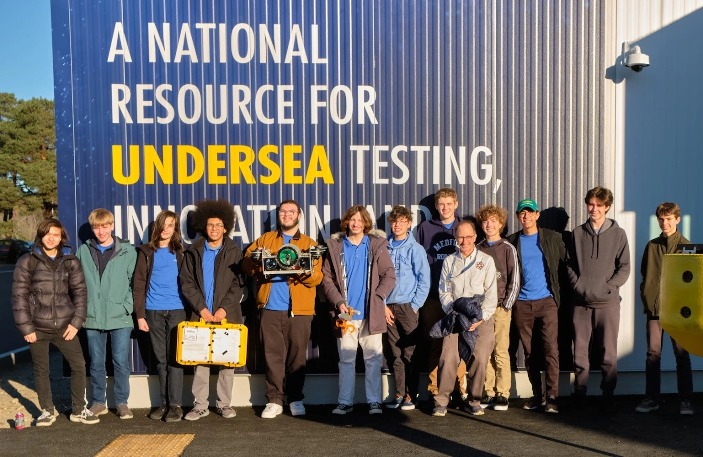
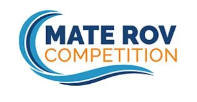
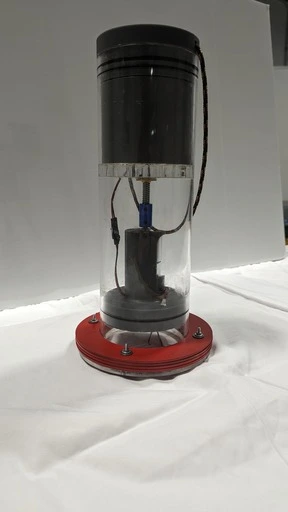
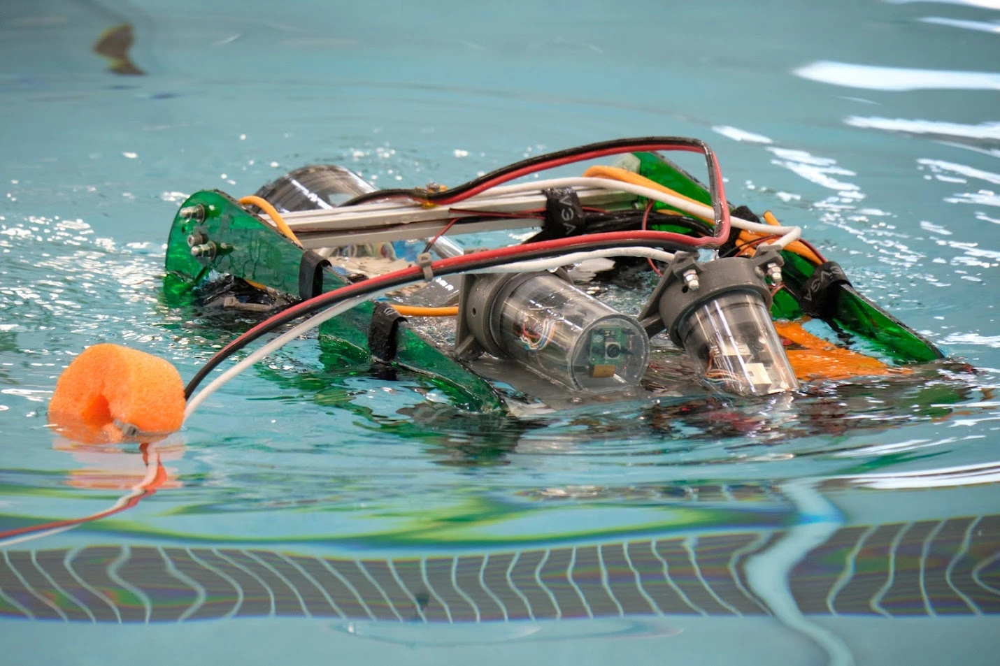

+++
title = "About"
+++

# What is Sunk Robotics?

We are an underwater robotics team based out of Medford Vocational Technical High School that competes in the MATE ROV Robotics Competition. 

We create underwater robots designed to aid in sustainability efforts by replacing divers in dirty, dull, distant, or dangerous jobs. Our fleet includes three robots: JONA ROV, STEVE ROV, and the Sunk Robotics Float.

If you are interested in supporting Sunk Robotics, or have any questions, you can reach us at sunk@sunkrobotics.com. 

# The MATE ROV Competition

Sunk Robotics has competed in the MATE ROV Competition for three years. MATE ROV is an underwater robotics competition where teams create Remote Operated Vehicles that do simulated tasks diving tasks, such as removing biofouling, or collecting data on coral reefs.

In MATE ROV, teams simulate companies. MATE ROV teams follow a corporate structure and earn points for non-engineering tasks such as marketing, techinical documentation, and corporate responsibility.

# The Sunk Robotics Fleet

Throughout the three year history of Sunk Robotics, we have had three robots in our fleet: JONA ROV, STEVE ROV, and the Sunk Robotics Float.

## JONA ROV

JONA ROV is our newest addition to the Sunk Robotics Fleet. Using an overhauled frame and a new PCB Based Electronics system, JONA ROV has improved maneuverability, reliability, and serviceability over STEVE ROV. 

## Sunk Robotics Float

The Sunk Robotics Float changes its density to move vertically in the water while using very little power. We emphasized simplicity in our design by using the housing as the wall of the piston and minimizing the amount of moving parts.

## STEVE ROV

STEVE ROV was Sunk Robotics first vehicle, and it won the New England Regional Competition two years in a row. Although STEVE has been retired to piolet training, it is still an important part of Sunk Robotics history.

